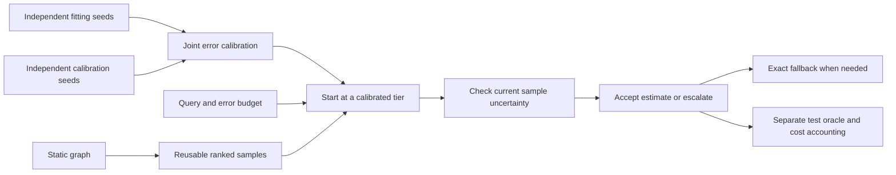

# Adaptive Graph Query Optimization

[](https://github.com/bowen-rgb/adaptive-multifidelity-graph-query/actions/workflows/checks.yml)

**A reproducible Python/Neo4j research prototype that trades aggregate-query precision for lower computation cost.**

Python · Neo4j · Cypher · NumPy · LDBC SNB · calibrated sampling · NSGA-II comparisons

The controller chooses a reusable sample size from an explicit error budget, checks
current empirical uncertainty and escalates to a larger sample or exact query when
needed. Independent fitting, calibration and testing keep evaluation data separate.
The current research scope is COUNT queries on known predicates in static graphs.

[Project brief](docs/project-brief.md) · [Measured results](docs/v017-joint-calibration.md) · [CV entry](docs/cv-project.md) · [中文面试讲解](docs/interview-guide-zh.md)

## Measured results

| Evidence | Result | Scope |
|---|---|---|
| Cost amortization | **1.34×** recorded phase-cost improvement: 303.14 s → 226.15 s | 50k-node graph; 6,000 node/edge request pairs; 20% error budget |
| Long-stream accuracy | **0/12,000** observed budget violations; maximum error **11.26%** | Three new rank epochs; repeated known predicates |
| Independent accuracy | **0/2,400** observed violations per graph size | 100 new sampling epochs each at 50k/100k; most answers still sampled |
| Database semantics | **138,474** reference operations validated across **29** operation types | Official LDBC SNB Interactive v1 reference sequence, SF0.1 |

The 1.34× comparison includes recorded training, joint fitting, sample builds,
session initialization and online queries. Graph import, profile reading and
per-test oracle checks are excluded. Training was measured previously; the phase
sum is not a single continuous lifecycle measurement. Zero observed failures are
not a precision guarantee. **Short streams and strict 5% budgets did not show
useful overall savings.** Full SNB adaptive acceleration remains unproven.


## Try it without Neo4j

Python 3.10+; CI runs Python 3.12. From a fresh checkout:

```sh
git clone https://github.com/bowen-rgb/adaptive-multifidelity-graph-query.git
cd adaptive-multifidelity-graph-query
python -m venv .venv
```

Activate the environment (`.venv\Scripts\Activate.ps1` in PowerShell or
`source .venv/bin/activate` on Linux/macOS), then:

```sh
python -m pip install -e ".[experiments]"
python -m graph_mf --backend memory smoke
python scripts/demo_joint_sampling.py
```

The demo fits and calibrates a 50,000-node synthetic graph, then prints requested error
budget, selected fidelity, observed error and probe count. FR/DE are calibrated;
ES illustrates exact fallback for an unknown predicate. Its exact answer is used
only for afterward verification. **The offline demo is not a Neo4j performance
benchmark.** Results are saved under ignored `results/local/`.
Tier choices depend on local calibration cost forecasts. Use `--nodes 2000` for
a smaller smoke run; small samples may correctly trigger more exact fallbacks.

The tiny graph smoke works with only `python -m pip install -e .`; the algorithm
demo additionally requires the experiment dependencies above.

## How it works



At fidelity f, each node is included with probability f. Node estimates scale by
1/f; counts of edges whose two distinct endpoints are selected scale by 1/f².
Joint calibration covers the fixed known countries, COUNT kinds and tiers at the
sampling-epoch level. General multi-hop queries do not inherit this scaling rule.
The controller executes fresh COUNTs; it does not memoize previous answers.

## Inspect or reproduce the evidence

- [Calibration](graph_mf/sample_correction.py), [controller and generation guards](graph_mf/incremental_sampling.py), [Neo4j/memory query backends](graph_mf/synthetic.py).
- [Paired experiment runner](scripts/benchmark_dlss_ablation.py), [report generator](scripts/report_joint_calibration.py), [raw long-stream records](results/neo4j/joint-long-50k-v017).
- [Independent joint-calibration report](docs/v017-joint-calibration.md) contains the full replication commands and measurement boundaries.
- [LDBC full runbook](docs/ldbc-full-runbook.md) covers separate databases, pinned upstream queries and official-driver validation. Raw input archives are not bundled.
- [Complete experiment history and beginner Cypher tutorial](EXPERIMENTS.md), [roadmap](docs/roadmap-to-v1.md) and [original preserved v0.1](v0.1).

```sh
python -m unittest discover -s tests -v
```

CI also runs offline benchmarks and sampling smoke checks. Live Neo4j experiments
require optional database dependencies, a running instance and credentials supplied
through the documented environment configuration. No credentials are committed.

## Research status

The supported contribution is a functioning graph-query pipeline with independently
calibrated precision/cost trade-offs and measured savings in a specific amortized
workload. Unseen topology, nonrepeating parameters, concurrent updates and full SNB
adaptive performance remain open. NSGA-II, random and learned search comparisons
are retained without claiming that the learned method dominates. This is a
DLSS-inspired sampling project; it has no NVIDIA DLSS or robotics integration.

Developed with AI assistance. Official query snapshots retain upstream Apache
attribution, LICENSE and NOTICE in [third_party/ldbc](third_party/ldbc).
