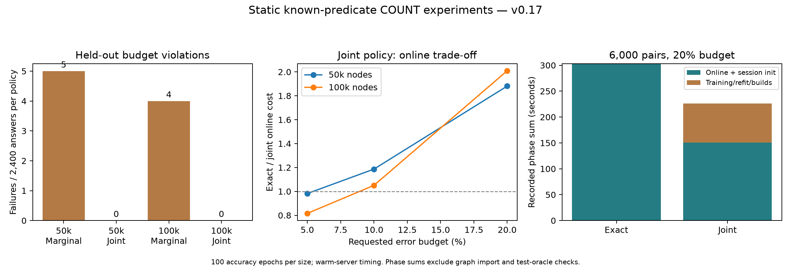

# v0.17 — Joint calibration and independent reliability checks

## Fixed experiment design

Compare the unchanged marginal `no_history` policy with `joint_no_history` and exact.
Joint calibration normalizes errors using scales computed only from fitting seeds;
one calibration score is the maximum over both known countries, both COUNT kinds
and every fidelity. Its 90% empirical quantile is computed from 20 calibration seeds.
The controller checks current sample size, probes afresh and falls back to exact
for unknown predicates. No held-out test seed tunes the policy or thresholds.
All original training measurements are reused and charged; joint fitting cost is added.

For each fixed component/tier j, fitting defines a residual scale s_j using
relative error divided by sqrt(reference_sample_count / current_sample_count).
Each calibration epoch supplies a single maximum normalized residual over j
and countries. The 19th ordered maximum of 20 epochs supplies multiplier Q.
Runtime bound_j = Q * s_j * sqrt(reference_count_j / observed_count_j).
If all these bounds cover a particular rank realization, choosing any accepted
tier from this fixed set preserves its requested budget. The empirical quantile
does not establish that condition on every future realization or changed graph.

Accuracy checks use 100 fresh rank epochs (22000–22099) per size and changing
5%/10%/20% budgets. Live timing uses six separate epochs (23000–23005),
randomized paired order and a warm server. Memory checks supply accuracy evidence only.
Repeated requests share ranks; the epoch, not each repeated request, is the independent unit.

## Held-out accuracy

| Nodes | Policy | Budget failures/components | Epochs with any failure | Approximate components | Max error |
|---:|---|---:|---:|---:|---:|
| 50,000 | exact | 0/2400 | 0/100 | 0 | 0.00% |
| 50,000 | no_history | 5/2400 | 3/100 | 2400 | 16.58% |
| 50,000 | joint_no_history | 0/2400 | 0/100 | 2000 | 14.27% |
| 100,000 | exact | 0/2400 | 0/100 | 0 | 0.00% |
| 100,000 | no_history | 4/2400 | 3/100 | 2400 | 19.48% |
| 100,000 | joint_no_history | 0/2400 | 0/100 | 2191 | 8.45% |

## Isolated live timing

| Nodes | Policy | Online ratio vs exact (95% paired bootstrap) | Budget failures | Recorded phase ratio including startup |
|---:|---|---:|---:|---:|
| 50,000 | exact | 1.00 [1.00, 1.00] | 0/720 | 1.00 |
| 50,000 | no_history | 1.72 [1.60, 1.87] | 0/720 | 0.19 |
| 50,000 | joint_no_history | 1.33 [1.18, 1.49] | 0/720 | 0.18 |
| 100,000 | exact | 1.00 [1.00, 1.00] | 0/720 | 1.00 |
| 100,000 | no_history | 2.33 [2.14, 2.51] | 0/720 | 0.18 |
| 100,000 | joint_no_history | 1.23 [1.16, 1.33] | 0/720 | 0.17 |

## Joint policy by requested budget

| Nodes | Error budget | Online ratio vs exact | Failures/components | Maximum error |
|---:|---:|---:|---:|---:|
| 50,000 | 5% | 0.98 | 0/240 | 1.09% |
| 50,000 | 10% | 1.19 | 0/120 | 3.56% |
| 50,000 | 20% | 1.88 | 0/360 | 6.50% |
| 100,000 | 5% | 0.82 | 0/240 | 1.80% |
| 100,000 | 10% | 1.05 | 0/120 | 4.48% |
| 100,000 | 20% | 2.01 | 0/360 | 5.22% |

Budget-specific rows sum matched online request measurements, excluding session
construction and training/builds. They are descriptive subdivisions of the same
six live epochs, not additional independent experiments. Strict budgets may be slower.
Use exact when required precision eliminates worthwhile sampling, and reserve
approximation for workloads that explicitly accept measured precision loss.

## Prespecified longer-stream cost check



50,000 nodes, 6,000 request pairs, 3 new rank epochs (24000–24002), fixed 20% budget.
Only exact and the unchanged joint policy are compared; no thresholds are retuned.
The 20% budget and 6,000-pair horizon were fixed after the short-stream pilot
and before evaluating these three new ranks; this is a selected-use-case confirmation.
Exact online + session construction: 303.14 s.
Joint online + session construction: 150.79 s; recorded training/refit/sample builds: 75.37 s.
Recorded joint phase sum: 226.15 s; baseline/phase-sum ratio **1.34×** (online ratio 2.01×).
Budget violations: 0/12000; maximum observed error: 11.26%.
Repeated requests share only three rank realizations. This is a cost-amortization
check on known static predicates, not additional large-scale statistical validation.
Original training was measured previously; the sum of recorded phases is not one
continuous lifecycle wall-clock measurement. Graph import and test-oracle checks
are excluded; the original training workflow includes its internal validation.
All discarded probes, exact fallbacks and session initialization are charged.

## Interpretation boundaries

Report observed failures even after joint calibration. Neither zero observed failures
nor an empirical quantile establishes an unconditional per-request guarantee.
Both graph sizes share the same topology generator and FR/DE predicates; profiles
are fit separately. Unseen topology, changed graph data and parameterized SNB queries
are outside this experiment. More conservative calibration can erase speed benefits.
Six timing blocks support a descriptive host-local comparison, not general significance.
The short streams charge all recorded training and sample builds but do not amortize them.
Graph import, profile reading and test-oracle validation are excluded. The earlier 1.78×
long-stream result remains scoped to v0.15, not automatically transferred to this policy.

## Reproduction

```powershell
python scripts/benchmark_dlss_ablation.py --backend neo4j --source results/neo4j/dynamic-correction-v014 --epochs 6 --requests 60 --seed-start 23000 --joint-calibration --output results/local/new-joint-50000
python scripts/benchmark_dlss_ablation.py --backend neo4j --source results/neo4j/correction-100k-v016 --epochs 6 --requests 60 --seed-start 23000 --joint-calibration --output results/local/new-joint-100000
python scripts/benchmark_dlss_ablation.py --backend memory --source results/neo4j/dynamic-correction-v014 --epochs 100 --requests 12 --seed-start 22000 --joint-calibration --output results/local/new-joint-accuracy-50000
python scripts/benchmark_dlss_ablation.py --backend memory --source results/neo4j/correction-100k-v016 --epochs 100 --requests 12 --seed-start 22000 --joint-calibration --output results/local/new-joint-accuracy-100000
python scripts/benchmark_dlss_ablation.py --backend neo4j --source results/neo4j/dynamic-correction-v014 --epochs 3 --requests 2000 --seed-start 24000 --joint-calibration --modes exact joint_no_history --budgets 0.2 --output results/local/new-joint-long
python scripts/report_joint_calibration.py --accuracy results/memory/joint-50k-v017 results/memory/joint-100k-v017 --live results/neo4j/joint-50k-v017 results/neo4j/joint-100k-v017 --long results/neo4j/joint-long-50k-v017
```
