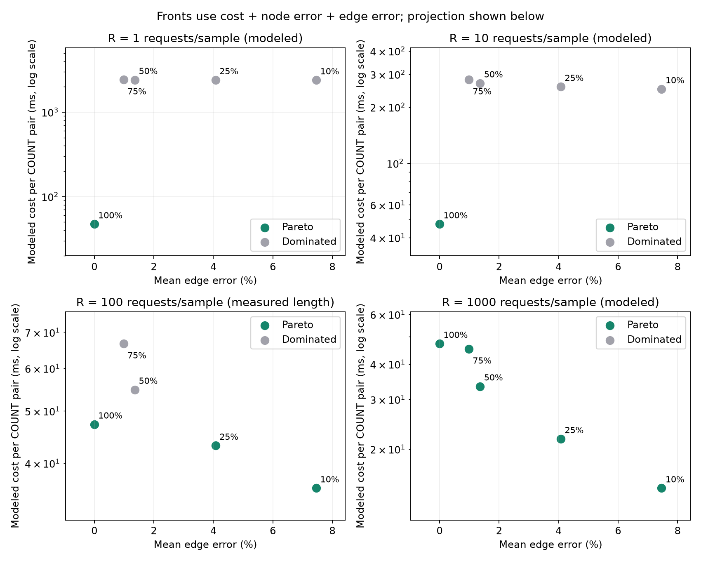

# Pareto and categorical NSGA-II baseline — v0.4

Analysis date: 2026-10-06. Input: the completed v0.3.1 50,000-node Neo4j
reuse experiment. All previous measurements remain unchanged. This release performs
offline analysis and does **not** make new Neo4j queries or collect new database timings.

## Objectives and reference

Minimize three objectives independently:

1. Modeled mean request cost = measured mean request time + measured mean build time / R.
2. Mean relative node COUNT error across the original 20 independent samples.
3. Mean relative edge COUNT error across the same samples.

R is a fixed assumed number of requests served by one static sample. It is **not** an
optimized gene; otherwise the algorithm could select unlimited reuse without a
freshness constraint. Five candidates are the recorded 10/25/50/75/100% fidelity levels.
Exact COUNT has zero sampling error and needs no sample construction.
Only R=100 matches the measured repeat length. R=1,10,1000 extrapolate the same timing
means using a cost model; they are not additional measured workloads.

Pareto dominance requires no objective to be worse and at least one strictly better.
Exhaustive enumeration gives the exact front for these recorded candidate values.
It does not establish the true front under timing uncertainty or a different graph.

| Assumed requests per sample | Exhaustive Pareto fidelity levels | Chosen with node ≤2%, edge ≤5% | Chosen with node ≤1%, edge ≤2% |
|---:|---|---:|---:|
| 1 | 100% | 100% | 100% |
| 10 | 100% | 100% | 100% |
| 100 | 10%, 25%, 100% | 25% | 100% |
| 1000 | 10%, 25%, 50%, 75%, 100% | 25% | 50% |

At R=100, modeled 25% cost is 43.11 ms/request; exact cost is 47.21 ms/request.
50% costs 54.76 ms and 75% costs 66.64 ms, both with positive errors, so exact COUNT
dominates them. At R=1000 their amortized construction cost is lower; all five become
nondominated. The constraints above use historical **mean** errors, not confidence
bounds or guarantees on individual queries. Zero tolerances select exact COUNT.

## NSGA-II implementation and comparison

Implemented in `graph_mf/optimization.py` using only the Python standard library:
fast nondominated sorting, normalized crowding distance, binary rank/crowding
tournaments, uniform categorical inheritance, mutation to another fidelity, and
elitist selection from combined parents and offspring. Constant objectives contribute
zero crowding distance. Duplicate individuals are permitted. Tie order is seeded.
This is a categorical variation adaptation of
[Deb et al., 2002](https://doi.org/10.1109/4235.996017); it does not use the paper's
continuous-variable crossover/mutation operators.

Population 8, 20 generations, mutation probability 0.2. Seeds 0–29 for each of four
reuse scenarios: **120 runs**. Initial populations sample categories randomly with
replacement; they are not initialized with all candidates or the exhaustive front.
Objective lookups are memoized, and exhaustive answers never guide selection.

All 120 final populations recovered the full exhaustive front with precision 1.0 and
recall 1.0. Each run made 168 candidate requests, covering all five unique candidates.
Exhaustive evaluation requires only five candidates. This comparison verifies the
integration on a small domain and **does not show a search efficiency advantage**.
It also does not test convergence on a large graph optimization parameter space.

Final-population fronts are reported separately from the nondominated set of all
visited candidates. The latter is diagnostic only and never helps parent selection.
Per-run metrics are in `nsga2-runs.csv`; every generation is retained in `traces.json`.
The selector uses exhaustive feasible candidates, so evolutionary omissions cannot
silently remove a valid recommendation in this five-level setting.

## Reproduce and inspect

```sh
python -m graph_mf optimize --source results/neo4j/reuse-50k-v031 --output results/local/new-v04-run
python -m graph_mf select-fidelity --reuse-requests 100 --node-tolerance 0.02 --edge-tolerance 0.05
python -m unittest discover -s tests -v
```

Optional figure regeneration (requires the experiment dependencies, including matplotlib):

```sh
python scripts/plot_pareto.py results/local/new-v04-run
```

Recorded analysis: `results/optimization/v04-baseline/`. It includes candidate costs,
front membership, seeded-run comparisons, budget selections, traces and metadata.
Metadata records the source graph fingerprint and source file hashes using UTF-8 text
with LF-normalized newlines, so hashes survive Windows/Linux Git line endings.

Validation: 23 offline tests passed; four opt-in database integration tests were skipped
because this release only changes offline analysis. Checks cover known dominated fronts,
duplicate scores, normalized crowding, constant objectives, deterministic search,
memoized evaluations, selection budgets, CLI output and source provenance. Existing
tiny fallback smoke and v0.1 regression tests passed. All archived v0.1 file hashes match.



The figure projects cost and edge error; Pareto membership is computed using all
three objectives, including node error. Other reuse counts remain modeled scenarios.

## Limits and next step

Timing means and empirical errors come from one graph, country predicate, machine and
warm-cache workload. No held-out workload, confidence-bound selector, live controller,
freshness policy, cold-cache, energy or memory optimization is added here. Repeated
requests retain the same sampling error. The original v0.1 heuristic is still preserved.

Next: measure additional fidelity/policy settings with separated calibration and
evaluation samples, then compare exhaustive search and NSGA-II on that broader space.
The proposed DLSS-style scaling method needs an explicit reconstruction/feedback rule
and an independent error/cost comparison; it is not implemented by renaming sampling.
