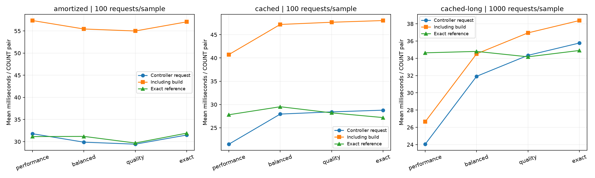
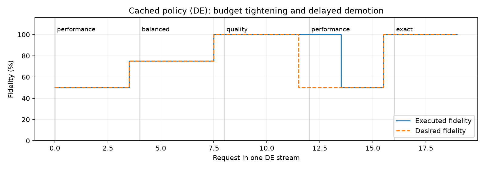

# Measured adaptive aggregate scaling — v0.5

Measured 2026-10-06 on local Neo4j 2026.09.0 Enterprise: 50,000 nodes / 149,996 edge records.
Five predicates (FR/DE/ES/IT/NL), eight levels (5/10/15/25/35/50/75/100%).
Warm cache, one serial client. Each request returns a pair of COUNT aggregates.

## Measured results

| Planning scenario | Tier | Request mean / p95 (ms) | Including build amortization (ms) | Exact reference mean (ms) | Node / edge mean error | Budget violations |
|---|---|---:|---:|---:|---:|---:|
| amortized | performance | 31.79 / 59.56 | 57.35 | 31.14 | 0.00% / 0.00% | 0.0% |
| amortized | balanced | 29.88 / 55.32 | 55.45 | 31.18 | 0.00% / 0.00% | 0.0% |
| amortized | quality | 29.43 / 60.05 | 55.00 | 29.69 | 0.00% / 0.00% | 0.0% |
| amortized | exact | 31.49 / 57.82 | 57.06 | 31.91 | 0.00% / 0.00% | 0.0% |
| cached | performance | 21.48 / 42.84 | 40.74 | 27.80 | 0.69% / 2.42% | 0.0% |
| cached | balanced | 27.95 / 62.39 | 47.20 | 29.52 | 0.30% / 1.24% | 3.3% |
| cached | quality | 28.42 / 48.88 | 47.67 | 28.21 | 0.00% / 0.00% | 0.0% |
| cached | exact | 28.78 / 52.14 | 48.04 | 27.20 | 0.00% / 0.00% | 0.0% |
| cached-long | performance | 24.05 / 41.74 | 26.65 | 34.64 | 0.79% / 3.13% | 0.0% |
| cached-long | balanced | 31.91 / 55.89 | 34.52 | 34.80 | 0.49% / 0.93% | 0.0% |
| cached-long | quality | 34.34 / 57.19 | 36.95 | 34.17 | 0.00% / 0.00% | 0.0% |
| cached-long | exact | 35.77 / 63.14 | 38.38 | 34.90 | 0.00% / 0.00% | 0.0% |

Request latency includes the initial low draft, all escalation queries, state checks,
correction and controller decisions. Graph generation/import and connection startup are excluded.
Each standalone adaptive stream receives the full measured sample-build cost, divided by
its actual request count per sample. Exact reference streams need no sample.
The mixed stream allocates sample cost to every request, including requests returning exact results.
This allocation is not the cost of running the exact tier alone, which needs no sample.

The amortized planner selected exact COUNT for all final answers in its measured run;
sample construction and initial drafts therefore made that adaptive stream more expensive.
The cached planner minimizes query cost after an existing sample is available. Query-only
savings do not establish overall savings when a sample is refreshed frequently.

## Complete mixed-stream cost

| Stream | Controller + build mean (ms/request) | Exact reference mean (ms/request) | Observed cost change |
|---|---:|---:|---:|
| amortized | 56.44 | 31.01 | +82.0% |
| cached | 44.88 | 28.11 | +59.7% |
| cached-long | 32.63 | 34.63 | -5.8% |

This table accounts for the entire measured mixture, including exact-tier requests.
Per-tier construction charges above are allocations within that mixture, not a claim
that each tier alone served 1,000 requests. Fitting/profiling setup costs remain separate.

## Costs, scope and independent samples

- amortized: 15 held-out sample seeds, 9,000 timed requests, 100 requests per standalone sample/stream; mean build 2556.56 ms. Import/connect 32.68 s; offline fitting/calibration 2.01 s; timing profiling 41.33 s.
- cached: 6 held-out sample seeds, 3,600 timed requests, 100 requests per standalone sample/stream; mean build 1925.52 ms. Import/connect 14.78 s; offline fitting/calibration 1.96 s; timing profiling 25.59 s.
- cached-long: 2 held-out sample seeds, 4,000 timed requests, 1000 requests per standalone sample/stream; mean build 2604.78 ms. Import/connect 15.22 s; offline fitting/calibration 1.97 s; timing profiling 11.55 s.

Raw COUNTs for all 16,600 timed requests and all adaptive escalation steps matched NumPy.
These are repeated requests, not independent accuracy trials. The first two streams serve
100 requests per sample; the long-reuse stream actually serves 1,000, rather than extrapolating.
The long stream has only two independent samples and is a conditional cost demonstration.
Its accuracy/violation rates must not be read as broad statistical guarantees.
The short cached balanced tier violated a budget on 3.3% of requests. Repetitions share
one sampling error, so this percentage is not a rate over independent queries.
Timing profiling used separate sample seeds before each evaluation run. Each run has its
own contemporaneous exact and fixed references; cross-run timings are not a controlled causal ablation.

## Correction ablation on the same returned levels

| Stream | Approximate requests | Raw node / edge mean error | Corrected node / edge mean error |
|---|---:|---:|---:|
| amortized | 0 | n/a | n/a |
| cached | 252 | 0.812% / 2.882% | 0.799% / 2.895% |
| cached-long | 1180 | 0.687% / 2.460% | 0.705% / 2.435% |

Correction gains may help or hurt these held-out samples; the table is a paired
comparison of the same returned levels, not a claim that calibration always improves accuracy.

## Agreed DLSS-inspired mechanism

The project owner approved low-fidelity drafts, calibration-based correction, uncertainty
gating and hysteresis. This implements that agreed prototype; it does not establish novelty,
implement NVIDIA DLSS, use neural super-resolution, or reconstruct arbitrary graph topology.

For nodes use count/f; for edges use count/f². Fit a multiplicative least-squares correction
per level/metric from seeds 2000–2019, then freeze it. Separately calibrate with seeds
3000–3039. One calibration score is the maximum normalized relative residual over all
five predicates, seven approximate levels and both metrics in a sample epoch. The 39th
ordered score of 40 supplies a nominal 95% joint threshold. This deliberately conservative
scheme keeps correlated queries within one independent unit.

Calibration uses a split-calibration order statistic inspired by
[Angelopoulos and Bates](https://arxiv.org/abs/2107.07511). Exchangeability and a fixed
workload are assumptions; no per-query guarantee or validity under graph/predicate shift is claimed.
All corrections, uncertainty bounds and timing tables are frozen before evaluation seeds.
Exact answers are used in fitting and post-return evaluation, never as runtime controller inputs.
The profile contains gains/bounds, not cached exact COUNT answers.

If relative residual bound is b<1, the interval is [prediction/(1+b), prediction/(1-b)].
The controller checks both node/edge budgets, minimum sample counts, then raises fidelity.
Promotion for a tighter budget is immediate. Demotion requires three consecutive requests
favoring the cheaper lower level. A changed country or sample generation resets history.
Unknown countries or a graph-fingerprint mismatch fall back to exact. Manual mutations
outside the project import APIs remain unsupported by the static-sample lifecycle.

## Tier presets

| Tier | Node budget | Edge budget |
|---|---:|---:|
| performance | 5% | 15% |
| balanced | 2% | 5% |
| quality | 1% | 2% |
| exact | 0% | 0% |

Tiers specify error budgets, not fixed fidelity percentages. The cached experiment
demonstrates runtime transitions; the defaults can legitimately select exact when cheaper.

## Plots





## Reproduce

```sh
python -m graph_mf --backend neo4j adaptive-benchmark --output results/local/new-amortized
python -m graph_mf --backend neo4j adaptive-benchmark --cost-policy cached --epochs 6 --evaluation-seed 6000 --output results/local/new-cached
python -m graph_mf --backend neo4j adaptive-benchmark --cost-policy cached --epochs 2 --repeats-per-tier 40 --timing-epochs 2 --evaluation-seed 7000 --baseline-fidelities --output results/local/new-long
python scripts/report_adaptive.py
```

The report generator reads the three committed named result folders; its plots require matplotlib.
Metadata, profiles, timing measurements, builds, raw requests and per-request decisions are retained.
Memory backend runs the same controller/validation workflow without Neo4j.

## Validation and limits

30 offline tests passed; four existing opt-in integration tests were skipped. New live
measurement requests were separately validated against NumPy as recorded above.
Offline tests cover correction, budget tightening, delayed demotion, sparse/unknown fallback,
exact bypass, generation reset, independent calibration splits and explicit cost policies.
CLI/package smoke, archived v0.1 hashes and GitHub checks are also verified.
No cold-cache, graph-size transfer, changing-graph, rare/new predicate, concurrency, energy
or memory-use experiment was performed. Approximate errors on this graph are not evidence
of performance or accuracy on LDBC/social/robotics workloads. NSGA-II remains a separate
recorded-candidate baseline; coupling it to a broader measured policy space is future work.
