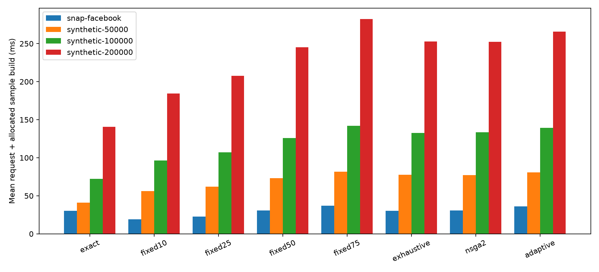

# v0.6: topology, scale and coupled selection

Measured live Neo4j results; generated from committed raw data. These runs use a warm
shared server. Five sample seeds per graph are independent sampling epochs, not
independent database deployments. All approximate strategies share frozen correction
and bounds. Timing seeds 8000–8002, evaluation seeds 9000–9004; fitting/calibration
use separate seed ranges. Every raw component count was checked against NumPy.

## Mixed-stream cost

Each standalone policy using any sampled call is charged its entire sample build
divided by its actual mixed-stream request count. Exact-only streams need no build.
This is a standalone allocation scenario; all modes share a prebuilt sample in the
measurement harness. Import, calibration, profiling and optimizer setup
are excluded here and itemized below. Fixed policies ignore the selected tier budget,
including exact-tier requests; their violations are expected baseline behavior.

| Graph | Policy | Request ms | With build ms | Budget violations |
|---|---|---:|---:|---:|
| snap-facebook | exact | 30.07 | 30.07 | 0.0% |
| snap-facebook | fixed10 | 14.10 | 19.11 | 82.4% |
| snap-facebook | fixed25 | 17.84 | 22.85 | 77.6% |
| snap-facebook | fixed50 | 25.81 | 30.82 | 64.8% |
| snap-facebook | fixed75 | 31.97 | 36.98 | 44.0% |
| snap-facebook | exhaustive | 30.47 | 30.47 | 0.0% |
| snap-facebook | nsga2 | 30.56 | 30.56 | 0.0% |
| snap-facebook | adaptive | 31.21 | 36.22 | 0.0% |
| synthetic-50000 | exact | 40.95 | 40.95 | 0.0% |
| synthetic-50000 | fixed10 | 14.84 | 56.09 | 69.6% |
| synthetic-50000 | fixed25 | 20.86 | 62.11 | 50.4% |
| synthetic-50000 | fixed50 | 31.72 | 72.98 | 36.0% |
| synthetic-50000 | fixed75 | 40.33 | 81.58 | 26.4% |
| synthetic-50000 | exhaustive | 36.45 | 77.70 | 0.0% |
| synthetic-50000 | nsga2 | 36.09 | 77.35 | 0.0% |
| synthetic-50000 | adaptive | 39.56 | 80.82 | 0.0% |
| synthetic-100000 | exact | 72.15 | 72.15 | 0.0% |
| synthetic-100000 | fixed10 | 18.46 | 96.33 | 61.6% |
| synthetic-100000 | fixed25 | 29.09 | 106.95 | 40.8% |
| synthetic-100000 | fixed50 | 47.85 | 125.72 | 26.4% |
| synthetic-100000 | fixed75 | 64.10 | 141.96 | 23.2% |
| synthetic-100000 | exhaustive | 54.78 | 132.65 | 0.0% |
| synthetic-100000 | nsga2 | 55.46 | 133.33 | 0.0% |
| synthetic-100000 | adaptive | 61.51 | 139.38 | 0.0% |
| synthetic-200000 | exact | 140.80 | 140.80 | 0.0% |
| synthetic-200000 | fixed10 | 26.20 | 184.44 | 51.2% |
| synthetic-200000 | fixed25 | 49.34 | 207.58 | 31.2% |
| synthetic-200000 | fixed50 | 87.12 | 245.36 | 21.6% |
| synthetic-200000 | fixed75 | 124.25 | 282.49 | 20.0% |
| synthetic-200000 | exhaustive | 94.37 | 252.60 | 0.0% |
| synthetic-200000 | nsga2 | 94.02 | 252.26 | 0.0% |
| synthetic-200000 | adaptive | 107.44 | 265.68 | 0.0% |

## Paired epoch differences versus exact

Positive means slower. These 95% percentile bootstrap intervals resample five paired
seed-epoch means (2,000 resamples), not correlated individual requests. They describe
this experiment only; five blocks are insufficient for broad statistical claims.

| Graph | Policy | Mean difference ms | Preliminary interval ms |
|---|---|---:|---:|
| snap-facebook | exhaustive | +0.40 | [-0.95, +1.75] |
| snap-facebook | nsga2 | +0.49 | [-0.95, +1.57] |
| snap-facebook | adaptive | +6.15 | [+5.07, +7.09] |
| synthetic-50000 | exhaustive | +36.76 | [+30.61, +41.91] |
| synthetic-50000 | nsga2 | +36.40 | [+32.22, +41.11] |
| synthetic-50000 | adaptive | +39.87 | [+34.51, +44.72] |
| synthetic-100000 | exhaustive | +60.50 | [+53.64, +66.84] |
| synthetic-100000 | nsga2 | +61.18 | [+54.61, +66.44] |
| synthetic-100000 | adaptive | +67.24 | [+59.50, +73.70] |
| synthetic-200000 | exhaustive | +111.80 | [+93.28, +134.84] |
| synthetic-200000 | nsga2 | +111.46 | [+94.15, +132.79] |
| synthetic-200000 | adaptive | +124.87 | [+105.88, +147.79] |

## Actual process resident memory

100 ms sampling. Whole-process ranges in MiB; sampled maxima may miss short peaks.
The server retains all earlier benchmark datasets. These are not per-graph allocations
and do not demonstrate memory savings from lower fidelity. See per-phase memory CSVs.

| Graph run | Python RSS MiB | Neo4j RSS MiB |
|---|---:|---:|
| snap-facebook | 26.0–129.4 | 1148.8–1247.3 |
| synthetic-50000 | 113.0–151.7 | 1158.6–1165.3 |
| synthetic-100000 | 124.5–200.9 | 1164.9–1271.9 |
| synthetic-200000 | 142.6–291.8 | 1271.9–1510.4 |

## Startup costs

Seconds, excluded from mixed-stream latency above. Profiling includes its sample builds.

| Graph | Import/connect | Fit/calibrate | Timing profile | Optimize |
|---|---:|---:|---:|---:|
| snap-facebook | 19.68 | 0.45 | 13.69 | 11.03 |
| synthetic-50000 | 21.08 | 5.37 | 24.86 | 12.92 |
| synthetic-100000 | 55.00 | 10.05 | 38.57 | 10.58 |
| synthetic-200000 | 88.66 | 9.27 | 64.83 | 8.54 |

## NSGA-II diagnostic

Ten seeds per predicate, population 32, 30 generations, 64 categorical pairs.
Only predeclared seed zero supplies runtime choices. The exhaustive front is used
only for diagnostic recall. This small space does not establish search efficiency.

Search optimizes cached query latency and the two calibrated bounds. Fitness is a
frozen-table lookup; profiling cost is reported separately. Build-inclusive costs
are evaluated afterward, so cached-optimal choices can lose on short streams.

| Graph | Reference-front size | Minimum final-front recall | Mean unique objective evaluations | Seed-zero choice agreement |
|---|---:|---:|---:|---:|
| snap-facebook | 4–8 | 75.0% | 62.2/64 | 100.0% |
| synthetic-50000 | 6–24 | 70.8% | 62.2/64 | 95.0% |
| synthetic-100000 | 16–32 | 53.1% | 61.7/64 | 95.0% |
| synthetic-200000 | 32–48 | 35.4% | 62.1/64 | 55.0% |

The largest reference front has 48 points. A 32-individual population cannot
retain all of it, even without duplicates. The implementation retains duplicate
individuals, so unique coverage can be lower still. Larger populations, diversity
handling and budget-specific selection need evaluation before optimality claims.

## Interpretation and remaining work

Public topology: [Stanford SNAP Facebook](https://snap.stanford.edu/data/ego-Facebook.html),
4,039 nodes and 88,234 undirected edges, each stored once. Degree buckets are derived
from the full topology; the shared adapter stores them in its legacy `country` field.
These custom COUNTs are not an official LDBC benchmark. Synthetic graphs retain
duplicate edge records and directional semantics from the original generator.

The controller independently chooses node/edge fidelity, charges its initial draft
and escalation calls, and delays demotion for three consecutive requests. Bounds
are graph-specific calibrated uncertainty, not per-query error guarantees.
See raw results and adaptive traces for errors, selected pairs and all escalation steps.

Still missing: full LDBC/complex traversals, independent cold-cache runs, long-stream
startup amortization, online audit/drift/refresh, energy measurements and novelty analysis.
No energy reduction, memory saving, neural DLSS implementation or novelty is claimed.

## Verification

All 40 unit/integration tests passed with live Neo4j opt-in enabled. The offline
run passes 36 tests and skips the four live cases. The final offline deep smoke
validated 1,200 requests. A wheel was installed into a fresh environment with no
Neo4j driver or NumPy, and the dependency-free tiny memory smoke passed.
All ten original v0.1 deliverable hashes remain unchanged. The live suite validated
12,000 timed requests plus their raw component/escalation counts.

Reproduce: `python scripts/report_deep.py`; raw source: `results/neo4j/deep-v06/`.

