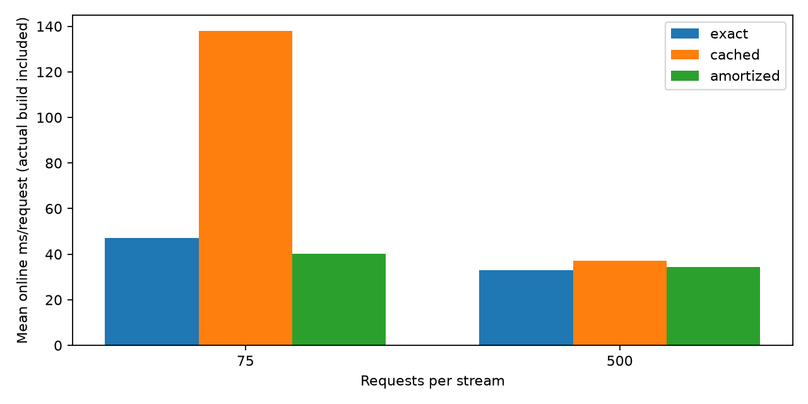

# v0.7：构建成本感知与 NSGA-II 改进

本轮解决 v0.6 的两个明确瓶颈：短流不值得构建抽样，重复候选和种群容量限制前沿保留。
原有 v0.6 代码默认行为与实测文件保留；新增 `amortized` 独立选档模式和可选种群去重。

## 成本感知选档

`cost = 节点查询预测耗时 + 边查询预测耗时 + 构建预测耗时 / 预期流长度`。
只有配置需要抽样时加一次构建成本；两个 COUNT 共享同一个抽样，不加两次。
构建预测来自 v0.6 计时种子，校准、误差界与计时表全部冻结；不使用留出样本的实测成本选档。
选择精确配置时直接执行精确 COUNT，不执行低档草稿、不构建抽样。需要近似时才延迟构建。
近似路径仍保留校准修正、不确定性门控、稀疏样本升档和三次降档滞回。

## 5 万节点真实 Neo4j 评测

共 5,175 次请求；每个流长度下运行 3 个样本种子。
每条流使用同一预算顺序：性能、均衡、质量、性能、精确。各模式的流执行顺序按种子随机化。
这是共享桌面数据库的顺序流测量，各流先预热精确查询；未清空缓存，也没有跨部署独立重复。
在线成本包括实际延迟构建、两个 COUNT、草稿/升档、校准、选档和分发。
精确模式也经过相同的外层分发与冻结表查找；原始记录另列内层请求和外层分发耗时。
数据导入、既有校准与计时准备成本未摊入本轮在线成本，所以不能声称整套系统冷启动加速。

完整计时在查询会话封装前完成；随后将同一构建/选档分发逻辑提取为 `CostAwareSession`。
封装后的接口另通过离线及真实数据库集成测试，未重跑全部计时。

| 每条流请求数 | 模式 | 查询与分发 ms/请求 | 含实际构建 ms/请求 | 平均构建 ms | 构建流数 | 预算超限 |
|---:|---|---:|---:|---:|---:|---:|
| 75 | exact | 47.00 | 47.00 | 0.00 | 0/3 | 0.0% |
| 75 | cached | 53.83 | 137.99 | 6311.89 | 3/3 | 0.0% |
| 75 | amortized | 40.17 | 40.17 | 0.00 | 0/3 | 0.0% |
| 500 | exact | 33.05 | 33.05 | 0.00 | 0/3 | 0.0% |
| 500 | cached | 27.85 | 37.18 | 4664.77 | 3/3 | 0.0% |
| 500 | amortized | 29.67 | 34.47 | 2402.92 | 3/3 | 0.0% |

`cached` 是旧控制器，假定抽样已有，但实测仍计入其本次构建成本。
`amortized` 是新控制器；已知预期流长度，按冻结预测判断是否值得构建。
选择全精确路径时与精确基线执行同样 COUNT，二者实测差异应视为计时波动和控制/分发开销，
不能把这种差异解释为查询算法加速。预测模型可能与当前服务器时延不一致，仍需在线审计。

构建函数在两种控制器中相同，长流实测构建耗时差异也可能来自缓存和流执行顺序；
不能把它解释为新模式让构建本身变快。长流相对旧模式的差值区间跨零，尚无稳定加速证据。

## 配对种子差值

新控制器减去对照模式，负数表示本轮成本更低。按完整种子流进行 2,000 次 bootstrap；
每个长度只有三个种子块，这些区间仅用于初步描述，不能作为跨环境性能保证。

| 流长度 | 对照 | 平均差值 ms/请求 | 初步 95% 区间 |
|---:|---|---:|---:|
| 75 | exact | -6.83 | [-11.97, -3.30] |
| 75 | cached | -97.82 | [-133.59, -52.22] |
| 500 | exact | +1.43 | [+0.24, +3.60] |
| 500 | cached | -2.70 | [-7.21, +1.30] |

## NSGA-II 工程消融：四组冻结 v0.6 数据

各配置比较相同种子 0–4；只有预先指定的种子 0 的最终前沿用于选档。穷举只用于诊断。
legacy32 复用旧结果；dedup32 只去重；capacity48 再扩大种群；improved48 再调整搜索参数。
去重只处理实际父代与子代的并集，不注入未见候选、不从穷举前沿补全。
这是一组在已知数据上的工程调参实验，没有新增数据库计时或独立泛化证据。

| 配置 | 种群 | 代数 | 变异率 | 去重 |
|---|---:|---:|---:|---|
| legacy32 | 32 | 30 | 0.2 | 否 |
| dedup32 | 32 | 30 | 0.2 | 是 |
| capacity48 | 48 | 30 | 0.2 | 是 |
| improved48 | 48 | 40 | 0.35 | 是 |

| 数据 | 配置 | 最低前沿召回率 | 种子 0 选档与穷举一致率 | 平均唯一评价数 | 最大预测成本差 ms |
|---|---|---:|---:|---:|---:|
| snap-facebook | legacy32 | 83.3% | 100.0% | 62.3/64 | 0.000 |
| snap-facebook | dedup32 | 75.0% | 100.0% | 62.8/64 | 0.000 |
| snap-facebook | capacity48 | 100.0% | 100.0% | 63.9/64 | 0.000 |
| snap-facebook | improved48 | 100.0% | 100.0% | 64.0/64 | 0.000 |
| synthetic-50000 | legacy32 | 70.8% | 95.0% | 62.4/64 | 0.625 |
| synthetic-50000 | dedup32 | 83.3% | 90.0% | 62.8/64 | 3.040 |
| synthetic-50000 | capacity48 | 95.8% | 100.0% | 64.0/64 | 0.000 |
| synthetic-50000 | improved48 | 100.0% | 100.0% | 64.0/64 | 0.000 |
| synthetic-100000 | legacy32 | 53.1% | 95.0% | 61.7/64 | 0.545 |
| synthetic-100000 | dedup32 | 87.5% | 100.0% | 62.4/64 | 0.000 |
| synthetic-100000 | capacity48 | 96.9% | 100.0% | 63.9/64 | 0.000 |
| synthetic-100000 | improved48 | 100.0% | 100.0% | 64.0/64 | 0.000 |
| synthetic-200000 | legacy32 | 39.6% | 55.0% | 61.6/64 | 3.030 |
| synthetic-200000 | dedup32 | 58.3% | 85.0% | 63.0/64 | 2.507 |
| synthetic-200000 | capacity48 | 96.9% | 100.0% | 63.8/64 | 0.000 |
| synthetic-200000 | improved48 | 100.0% | 100.0% | 64.0/64 | 0.000 |

改进配置在这批数据上恢复完整前沿，但候选只有 64 个，接近全部候选都被评价。
仅去重不保证选档更好：50k 数据的种子 0 一致率从 95% 降至 90%；扩大种群后恢复 100%。
因此没有搜索效率优势证据。小空间的实际选档继续优先使用穷举；NSGA-II 保留为研究路径。

## 验证与下一步

原始计数与所有草稿/升档调用均逐项对照 NumPy；误差预算超限如实记录在 CSV。
48 项测试通过，包括五项真实 Neo4j 集成测试；离线 CI 跳过这五项，其余 43 项运行。
成本模式离线烟雾测试覆盖 270 次请求。独立无 NumPy/Neo4j 驱动环境的基础回退仍可运行。
模型使用冻结校准界，不提供逐请求误差保证。短流避免构建是本轮可验证的行为变化。
下一步：在线抽查精确答案、发现误差/计时漂移后提高档位或刷新校准，并计入审计开销。
仍未完成：完整 LDBC/复杂遍历、冷缓存重复、能耗、独立创新性验证。

复现：`python scripts/compare_search_v07.py`（输出需新目录）；
`python -m graph_mf --backend neo4j cost-benchmark --output results/local/new-cost-run`；
`python scripts/report_v07.py`。

