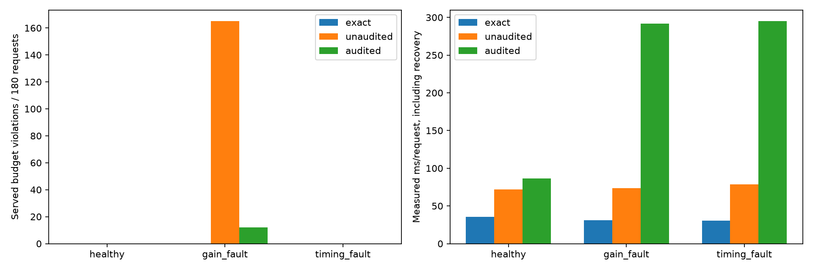

# v0.8：在线抽查、隔离与独立恢复

本轮在现有选档会话外加入精确锚点和计时模型漂移检查，检测后返回精确结果并隔离近似查询。
这是静态图上校准/计时表故障的可运行闭环；恢复由调用方明确触发，不是自主在线训练。



## 检测规则与盲区

- 首次近似请求、每个谓词首次近似请求、以及每十次近似请求执行两个精确 COUNT。
- 锚点发现节点或边误差超过当前档位预算时，该请求返回精确答案，后续请求保持精确。
- 排除构建与锚点后的候选耗时，与全部草稿/升档组件的预测耗时比较；连续三次超出三倍范围触发隔离。
- 计时规则是启发式，不能证明分布变化；本轮测试的是计时表失真，未制造真实服务器变慢。
- 抽查之间有盲区，不能保证每次回答满足预算。健康抽查仍返回原近似值。

## 真实 Neo4j 测量

50,000 节点，谓词 `DE`，performance 预算：节点 5%、边 15%。
三个场景 × 三种模式 × 3 个独立运行样本种子 × 60 请求 = 1,620 次。
每个场景内模式顺序按种子随机化；同一桌面数据库顺序执行，未清空缓存。重复请求误差相关，不是独立精度试验。
使用 cached 选档强制覆盖近似路径，真实新样本构建仍收费；不代表短流最优的 amortized 策略。
第 6 次请求将非精确档增益乘以 1.8，或将所选谓词计时预测乘以 0.01。精确模式不注入故障。
第 31 次请求前，仅为已经隔离的故障流执行独立恢复。图数据未变更。

| 场景 | 模式 | 全成本 ms/请求 | 返回值超预算/180 | 精度抽查次数 | 恢复准备均值 ms | 恢复近似的流数/3 |
|---|---|---:|---:|---:|---:|---:|
| healthy | exact | 35.63 | 0 | 0 | 0.00 | 0 |
| healthy | unaudited | 71.82 | 0 | 0 | 0.00 | 0 |
| healthy | audited | 86.54 | 0 | 21 | 0.00 | 0 |
| gain_fault | exact | 31.07 | 0 | 0 | 0.00 | 0 |
| gain_fault | unaudited | 73.60 | 165 | 0 | 0.00 | 0 |
| gain_fault | audited | 291.86 | 12 | 18 | 9505.40 | 3 |
| timing_fault | exact | 30.30 | 0 | 0 | 0.00 | 0 |
| timing_fault | unaudited | 78.70 | 0 | 0 | 0.00 | 0 |
| timing_fault | audited | 294.94 | 0 | 15 | 9301.92 | 3 |

精确/无审计/有审计三种模式的 raw COUNT 都逐条与相同种子的 NumPy 参考核对。
“原始 COUNT 正确”不等于缩放后的近似值满足预算；表中单列实际返回值超预算次数。

| 故障 | 运行 | 首次隔离请求 | 被返回的超预算值 | 恢复后确实通过锚点并返回近似值 |
|---|---:|---:|---:|---|
| gain_fault | 1 | 10 | 4 | True |
| gain_fault | 2 | 10 | 4 | True |
| gain_fault | 3 | 10 | 4 | True |
| timing_fault | 1 | 8 | 0 | True |
| timing_fault | 2 | 8 | 0 | True |
| timing_fault | 3 | 8 | 0 | True |

## 恢复与成本口径

恢复使用完整的本地图快照：20 个拟合种子、40 个误差界校准种子，以及独立计时种子。
计时重测覆盖五个谓词、两个组件、八个档位，各重复两次；不是充分的冷/热缓存统计研究。
校准训练不能使用已见运行样本或下一运行样本种子；拟合与校准集也必须互斥，图指纹必须匹配。
模型更新先验证再发布。恢复后的首次近似答案必须经精确锚点；只选择精确的模型保留 probing 状态。
在线成本包含选档、全部成功草稿/升档、抽样构建、精确锚点和返回分发；另将完整恢复准备耗时摊入流。
恢复准备包括图导入状态核对、CPU 校准、计时样本构建与全部计时查询；新运行样本的构建另按实际耗时计入。
既有原始图导入与初始 v0.6 校准/计时成本未摊入；未测能耗。本轮不声称整体加速。
会话能识别显式样本失效并回退；异常中断的部分查询仅标记计数不完整，墙钟仍收费。
任意外部图修改、并发写入、自动恢复调度及跨图泛化仍不支持。

## 可复现入口与原始数据

```powershell
python -m graph_mf --backend neo4j audit-benchmark --epochs 3 --requests 60 --output results/local/new-audit
python scripts/report_v08.py --live results/local/new-audit
```

- [完整请求与查询成本](../results/neo4j/audit-v08/raw-results.csv)
- [逐流检测与恢复](../results/neo4j/audit-v08/streams.csv)
- [恢复种子与准备成本](../results/neo4j/audit-v08/recoveries.json)
- [状态事件](../results/neo4j/audit-v08/events.json)
- [实验范围与指纹](../results/neo4j/audit-v08/metadata.json)

## 验证

55 项测试全部通过，包含 5 项真实 Neo4j 集成测试；另完成 720 次内存回退烟雾请求。
GitHub CI 增加在线审计内存烟雾检查。原 v0.1 文件继续按 SHA-256 清单核对。

下一步重点：降低全量恢复准备成本、选择审计间隔并比较检测延迟/漏检/成本，再扩展谓词与预算。
能耗目标、正式 LDBC 工作负载与跨部署验证仍需完成，研究新颖性未由本轮实验建立。
