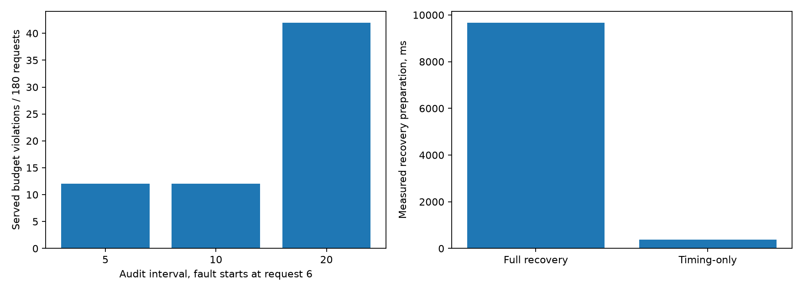

# v0.9：审计间隔与定向计时恢复

本轮优先解决 v0.8 的全量恢复开销，并把“审计间隔”作为明确的误差/成本取舍。
完整的剩余计划和 v1.0 验收条件见 [路线图](roadmap-to-v1.md)。

## 设计和可比较范围

完成 4,320 次真实 Neo4j 请求；5 万节点的既有静态图、DE 谓词和 performance 预算。
每个场景/模式为 3 个独立运行样本种子，每条流 60 次请求。
比较间隔 5/10/20 下的健康/增益失真场景；另比较计时失真后的完整恢复与定向恢复。
场景种子、预算、故障相位、精确/无审计/有审计路径保持一致。块内模式顺序随机化，块间顺序固定。
所有故障从第 6 次请求开始，第 31 次前恢复；未改变图数据或制造真实服务器变慢。
cached 选档用于覆盖近似路径，新样本构建和完整恢复成本都收费；不是短流最优策略。
所有成功原始 COUNT，包括恢复计时查询，都与同种子 NumPy 参考核对。

## 审计间隔

| 间隔 | 场景 | 精度抽查次数 | 返回值超预算/180 | 全成本 ms/请求 | 首次隔离请求 |
|---:|---|---:|---:|---:|---|
| 5 | healthy | 39 | 0 | 75.48 | 无, 无, 无 |
| 5 | gain_fault | 30 | 12 | 301.73 | 10, 10, 10 |
| 10 | healthy | 21 | 0 | 94.64 | 无, 无, 无 |
| 10 | gain_fault | 18 | 12 | 334.25 | 10, 10, 10 |
| 20 | healthy | 12 | 0 | 88.07 | 无, 无, 无 |
| 20 | gain_fault | 12 | 42 | 305.88 | 20, 20, 20 |

墙钟成本未随抽查次数单调变化；各块实际构建耗时不同且块序固定，不能据此认定哪个间隔最快。
固定第 6 次发生故障时，5/10 间隔都在第 10 次检出，漏过第 6–9 次；20 间隔到第 20 次才检出。
所以此处不能把 5 次间隔称为比 10 次更有效，也不能据此推荐所有负载的最佳间隔。
在“所有请求均近似、永久失真、固定周期审计”的简化模型中，间隔 k 的最坏漏过数量为 k−1；
若发生相位在周期中均匀分布，平均为 (k−1)/2。这是解析模型，不是本轮实测覆盖保证。

## 单纯计时漂移：保留校准和抽样

`refresh_timing(predicate)` 仅允许用于 timing_drift 隔离。它重测一个谓词的 2×8×2=32 个 COUNT，
不重新拟合增益/误差界、不重建抽样；保留训练种子，使用运行样本收集计时反馈。
这不是独立精度校准，也不能修复误差预算失败。新表完整验证后才发布；失败继续隔离。
首次恢复近似结果仍需要精确锚点通过；如果新表只选择精确档，则状态仍为 probing。

| 恢复方式 | 准备均值 ms | 全成本 ms/请求 | 返回值超预算/180 | 真正恢复近似的流数/3 |
|---|---:|---:|---:|---:|
| 完整独立恢复 | 9675.54 | 298.42 | 0 | 3 |
| 定向计时恢复 | 382.16 | 88.33 | 0 | 3 |
| 完整块精确对照 | 0.00 | 32.15 | 0 | 0 |
| 定向块精确对照 | 0.00 | 35.47 | 0 | 0 |

本轮定向恢复准备耗时比完整恢复低 **96.1%**。
按相同运行种子配对，完整流成本差（定向−完整）均值为 -210.09 ms/请求，
三种子 bootstrap 95% 区间为 [-238.48, -188.51] ms/请求。
只有三对种子且块间顺序固定，区间不能排除跨块环境偏差，不代表跨部署或总体加速。
本轮定向恢复流仍慢于精确对照；改善恢复开销不等于整套系统胜过精确查询。

## 成本、测试和下一步

完整流成本包含实际初始构建、草稿/升档、选档、锚点、全部恢复准备和恢复后的实际构建。
每条流的两个预热精确 COUNT、原始图导入及最初 v0.6 校准/计时成本未摊入。
未测能耗；图仍完整存储，无内存节省结论。
内存回退完成 1,920 次烟雾请求；定向计时是否选近似受回退计时表影响，不能当 Neo4j 性能证据。
58 项测试全部通过，包含 5 项真实 Neo4j 集成测试；基础示例另通过无 NumPy/Neo4j 安装包检查。
新增测试覆盖保留抽样/校准、禁止精度故障走计时恢复、计时失败不发布部分模型。
下一步按路线图：先确认真实能耗仪表可用性，再扩展能耗目标与工作负载/统一报告。
审计方面仍需多故障相位、多预算/谓词、自动恢复调度和更新版本协议。

```powershell
python scripts/compare_audit_v09.py --backend neo4j --epochs 3 --requests 60 --output results/local/new-comparison
python scripts/report_v09.py --live results/local/new-comparison
```



[完整对照摘要](../results/neo4j/audit-v09/comparison.json)；
[块列表与执行顺序](../results/neo4j/audit-v09/metadata.json)。
每块目录保留 raw-results.csv、streams.csv、summary.csv、恢复记录、校准模型与状态事件。
